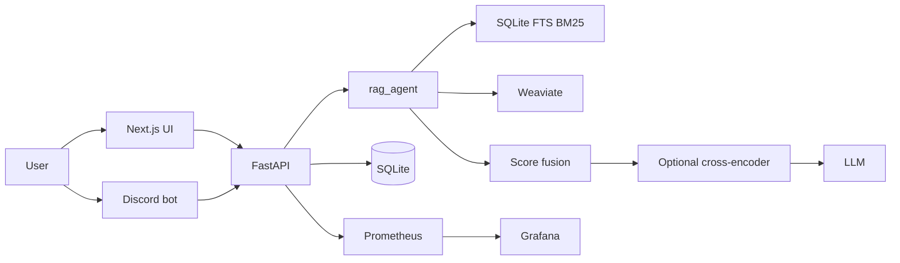

# Discord RAG Bot

Local-first RAG assistant for Discord and a small web UI. A FastAPI service retrieves from **SQLite FTS (BM25)** and **Weaviate**, fuses the two lists, optionally reranks, then asks an LLM to answer only from that context.

This is a **portfolio / local-development** system. It is not a hosted product, not a Kubernetes deployment, and GitHub Actions here is **CI** (test, lint, image build, Bandit) — not CD.

[](https://github.com/nabinkim0318/discord_rag_bot/actions/workflows/main.yml)
[](LICENSE)

## What this is

| It does | It does not |
| --- | --- |
| Hybrid BM25 + vector retrieval with explicit fusion | Treat leftover MMR parameters as a live stage |
| Persist queries and thumbs-up/down feedback | Expose query or feedback history as a public list API |
| Fail closed on RAG errors (no mock answers) | Provide multi-region HA or a status page |
| Ship Prometheus + a provisioned Grafana dashboard | Enforce SLO targets as product guarantees |
| Run a committed BM25 retrieval smoke eval in CI | Score generated-answer quality |

## Architecture



| Service | Role | Host bind (Compose) |
| --- | --- | --- |
| `api` | FastAPI + `rag_agent` | `127.0.0.1:8001` |
| `weaviate` | Vector index | `127.0.0.1:8080` |
| `frontend` | Next.js pages UI | `127.0.0.1:3000` |
| `bot` | Discord bot (`discord` profile) | no published port |
| `prometheus` | Scrapes API (+ Weaviate) | `127.0.0.1:9090` |
| `grafana` | Provisioned RAG dashboard | `127.0.0.1:3001` |

SQLite is the default application database. PostgreSQL-compatible SQLModel/Alembic code exists; Compose does **not** start Postgres.

## Live retrieval path

`generate_answer` is the runtime path used by `/api/query/`, `/api/v1/rag/`, and `/api/v1/enhanced-rag/`.

1. **BM25** over SQLite FTS5
2. **Vector search** in Weaviate (OpenAI embeddings when configured)
3. **Fusion** — weighted score fusion first, Reciprocal Rank Fusion if that path fails
4. **Optional cross-encoder rerank** when `sentence-transformers` is available
5. **Optional Cohere/Jina rerank** after generation retrieval, only if a provider key is present (`/api/v1/rag/` and `/api/query/` request Cohere by default; `/api/v1/enhanced-rag/` does not)
6. **Context packing** into a token budget
7. **LLM generation** (Azure OpenAI if configured, otherwise OpenAI)

**MMR is not on this path.** `mmr_lambda` / `MMR_LAMBDA` remain in signatures and `env.template`; they do not change live ranking. A legacy helper still contains MMR code and is unused by `generate_answer`.

If BM25 or Weaviate fails, that side returns empty and the other side can still proceed. If generation or the provider fails, the API returns a generic 503 — it does not invent an answer.

## Evaluation (retrieval only)

```bash
make eval-rag-demo
```

Indexes **6** committed synthetic documents, checks **8** gold cases, and scores BM25 ranking (nDCG, hit rate, and related ranking metrics). No Weaviate, LLM, Docker, or private data.

CI runs this as a **reproducibility smoke test**, not as a published retrieval benchmark and not as generation-quality evaluation.

Optional hybrid eval (Weaviate + embeddings required, not in CI):

```bash
make eval-rag-hybrid EVAL_GOLD=... EVAL_SQLITE=...
```

Details: [`rag_agent/evaluation/README.md`](rag_agent/evaluation/README.md)

## API, health, feedback

| Method | Path | Notes |
| --- | --- | --- |
| POST | `/api/query/` | RAG + persist query row; returns `query_id` |
| POST | `/api/v1/rag/` | RAG, no DB persist |
| POST | `/api/v1/enhanced-rag/` | Same `generate_answer` core; no Cohere rerank request |
| POST | `/api/v1/feedback/submit` | `up` / `down`; `user_id` is metadata, not auth |
| GET | `/api/v1/feedback/stats/{query_id}` | Aggregate counts only |
| GET | `/api/v1/feedback/summary` | Aggregate windowed summary |
| GET | `/api/v1/health/` | Process liveness |
| GET | `/api/v1/health/livez` | Process liveness (Compose healthcheck) |
| GET | `/api/v1/health/readyz` | SQLite + Weaviate; **503** if either fails |
| GET | `/api/v1/health/db` | `SELECT 1`; **503** on failure |
| GET | `/api/v1/health/vector-store` | Weaviate; **503** on failure |
| GET | `/api/v1/health/check` | Log-dir write probe; **503** on failure |
| GET | `/api/v1/health/llm` | Config status; live probe only if `HEALTH_LLM_PROBE_ENABLED=true` |
| GET | `/api/v1/enhanced-rag/health` | Same readiness as `/readyz`; **no RAG query** |
| GET | `/metrics` | Prometheus scrape |

Queries are bounded (`MAX_QUERY_LENGTH`, default **4000**; `top_k` 1–20). There is no public streaming flag and no public query-list or per-user feedback-history route.

Web thumbs send `{ query_id, score }` with no `user_id`; the API stores them under `"web"`. Discord sends the Discord user id for duplicate detection only.

## Observability and privacy

API request logs record **method, path, status, duration, request id**. They do not record prompt text, answers, or user/channel identifiers.

Grafana dashboard **RAG Bot Core Metrics Dashboard** (folder `RAG Bot`) is provisioned from `ops/grafana/`. Default Prometheus jobs: `prometheus`, `fastapi-backend` (`api:8001/metrics`), `weaviate`. Discord bot scrape is **opt-in** via the Discord Compose overlay. Panel queries and metric names: [`docs/observability.md`](docs/observability.md).

Provisioned example alerts (not SLOs): p95 pipeline latency and retrieval hit rate.

## CI

Workflow: [`.github/workflows/main.yml`](.github/workflows/main.yml) (`Main CI Pipeline`).

| Job name | What it gates |
| --- | --- |
| Backend (FastAPI) | isort, Ruff, pytest |
| RAG Agent Pipeline | isort, Ruff, pytest, `make eval-rag-demo` |
| Frontend (React/Next.js) | Prettier, ESLint, Jest |
| Docker Build | backend / rag_agent / frontend / bot images, **push: false** |
| Backend Security Scan (Bandit high/high) | `bandit -r app` — **high/high blocking**; full JSON is informational |
| Integration Check | Aggregate job after the five above |

Bandit is scoped to **`backend/app`**, not `rag_agent` or `bots`. A passing Bandit gate is not a general security audit.

`main` is protected by the repository ruleset **Protect main**, which requires the five named checks above (not `Integration Check`).

## Quick start

```bash
git clone https://github.com/nabinkim0318/discord_rag_bot.git
cd discord_rag_bot
cp env.template .env
```

Set at least `OPENAI_API_KEY` and `SECRET_KEY`. Grafana requires `GRAFANA_ADMIN_PASSWORD` (no committed default). Discord needs `DISCORD_BOT_TOKEN`.

```bash
make env-check
make docker-up              # api, frontend, weaviate, prometheus, grafana
make docker-up-with-bot     # also bot + Discord Prometheus scrape overlay
```

| URL | Service |
| --- | --- |
| http://127.0.0.1:3000 | Frontend |
| http://127.0.0.1:8001/docs | API docs |
| http://127.0.0.1:9090 | Prometheus |
| http://127.0.0.1:3001 | Grafana (user `admin` unless `GRAFANA_ADMIN_USER` is set) |

Weaviate anonymous access is off. Compose and the API share `WEAVIATE_API_KEY` (template default `local-dev-weaviate-api-key`). That is local-dev only.

Without Docker: `make install` then `make run-backend` / `make run-frontend`.

## Development

```bash
make test          # backend + rag_agent + frontend
make lint
make format-check
make eval-rag-demo
```

Python **3.11** and Node **20** match CI. Dependencies: Poetry (`backend/`, `rag_agent/`), npm (`frontend/`). Discord bot extra deps: `bots/discord/requirements.txt`.

## Repository layout

```text
backend/          FastAPI, Alembic, tests
rag_agent/        ingestion, retrieval, generation, demo eval
frontend/         Next.js (pages router)
bots/discord/     interactions.py bot
ops/prometheus/   scrape config
ops/grafana/      datasource, dashboard, example alerts
docs/             guides (index: docs/README.md)
docker-compose.yaml
docker-compose.discord.yaml
env.template
```

## Limitations

- Compose binds to **loopback**. No TLS, ingress, or cloud deploy in-repo.
- Schema lifecycle is **Alembic**; SQLite is the default DB. Postgres is not provisioned here.
- Discord feedback button state is **process-local** (TTL/size-bounded). Restarts expire buttons.
- Anonymous web feedback shares identity `"web"`.
- `HEALTH_LLM_PROBE_ENABLED` defaults **false** so CI/local health does not call a paid API.
- Demo eval scores are **not** a retrieval or generation benchmark.
- `MMR_LAMBDA` in `env.template` does not affect the live `generate_answer` path.

## Documentation

- [Documentation index](docs/README.md)
- [Docker / local Compose](docs/DOCKER.md)
- [RAG pipeline](docs/RAG_SYSTEM_GUIDE.md)
- [Retrieval evaluation](rag_agent/evaluation/README.md)
- [Discord bot](docs/DISCORD_BOT_GUIDE.md)
- [Observability](docs/observability.md)
- [Testing](docs/TEST_STRUCTURE.md)
- [Contributing](docs/CONTRIBUTING.md)

## License

[MIT](LICENSE) © 2025 Nabin Kim
